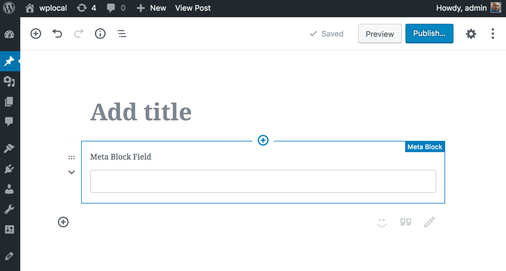

### Create Meta Block

Next you need to create a new block which will be used to display the field to the user. See the [Block Tutorial](../../../../../docs/designers-developers/developers/tutorials/block-tutorial/readme.md) for a deeper understanding of creating custom blocks.

For this block, you will use the PlainText component, which is similar to an HTML input text field. You can see the very large list of available components in the [editor package repository](https://github.com/WordPress/gutenberg/tree/master/packages/editor/src/components).


A couple of items to note:

1. The `withInstanceId` function creates a unique per component instance needed for the PlainText component.

2. By using `meta` as the source for the attributes, the loading and storing of post meta happens automatically.


Replace the previous content in `myguten.js` with the following:

```js
var el = wp.element.createElement;
var registerBlockType = wp.blocks.registerBlockType;
var PlainText = wp.editor.PlainText;

// generates unique id per component instance
var withInstanceId = wp.compose.withInstanceId;


// add some style
var labelStyle = {
  display: 'block',
  color: '#666',
  marginBottom: '10px',
  fontSize: '13px'
};

var fieldStyle = {
	border: '1px solid #CCC',
	borderRadius: '4px',
	padding: '4px 8px'
}

registerBlockType("myguten/meta-block", {
	title: "Meta Block",
	icon: "smiley",
	category: "common",

	attributes: {
		blockvalue: {
			type: "string",
			source: "meta",
			meta: "myguten_meta_block_field"
		}
	},

	edit: withInstanceId( function(props) {
		var className = props.className;
		var setAttributes = props.setAttributes;
		var instanceId = props.instanceId;

		var blockvalue = props.attributes.blockvalue;
		function updateBlockValue( blockvalue ) {
			setAttributes({ blockvalue });
		}

	return el(
			"div",
			{ className: className },
			el( "label", { htmlFor: instanceId, style: labelStyle }, "Meta Block Field" ),
			el( PlainText, {
				id: instanceId,
				value: blockvalue,
				onChange: updateBlockValue,
				style: fieldStyle,
			} )
		);
	}),

	// No information saved to the block
	// Data is saved to postmeta via attributes
	save: function() {
		return null;
	}
});
```

**Important:** Before you test, you need to update the dependencies in the enqueue. Note the wp packages used above are: wp.element, wp.blocks, wp.editor, and wp.compose. Each of these need to be included in the array of dependencies. Update the `myguten-meta-block.php` file so the enqueue function is:

```php
function gutentag_enqueue() {
	wp_enqueue_script( 'gutentag-script',
    	plugins_url( 'gutentag.js', __FILE__ ),
		array( 'wp-blocks', 'wp-element', 'wp-editor', 'wp-compose' )
	);
}
add_action( 'enqueue_block_editor_assets', 'gutentag_enqueue' );
```

You can now edit a draft post and add a Meta Block to the post. You will see your field which you can type a value in. When you save the post, either as a draft or published, the post meta value will be saved too. You can see this if you save and reload your draft, the form will still be filled in on reload.



You can now use the post meta data in a template, or other area of your plugin using the `get_post_meta()` function.

You could also confirm the data is saved by checking the database table `wp_postmeta` and confirm the new post id contains the new field data.

