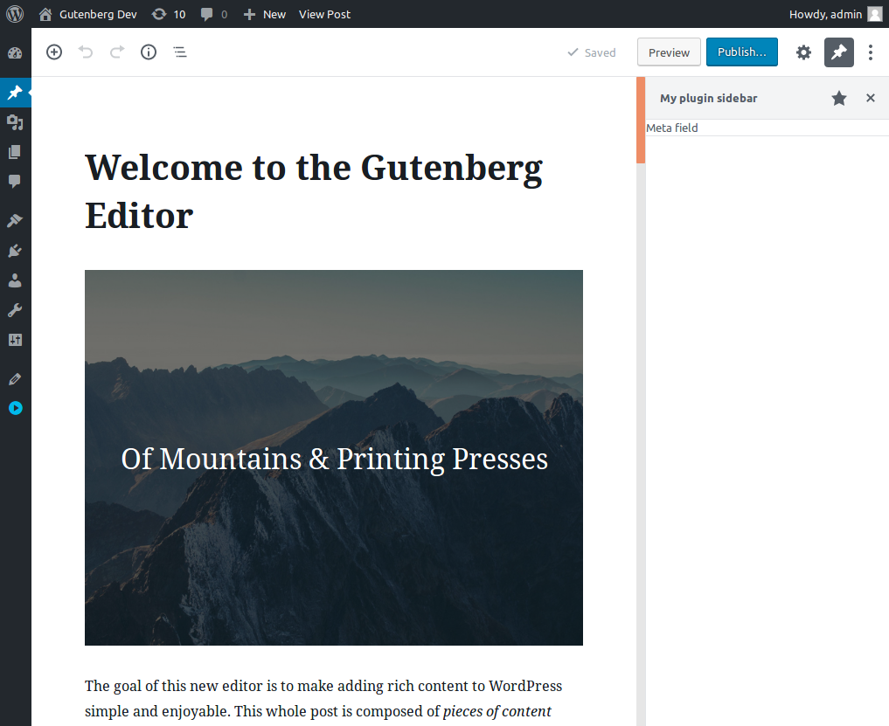

# Get a sidebar up and running

First, we need to tell the editor that we are registering a new plugin that will have its own sidebar. We can do so by using the [`wp.plugins.registerPlugin`](https://wordpress.org/gutenberg/handbook/designers-developers/developers/packages/packages-plugins/) and [`wp.editPost.PluginSidebar`](https://wordpress.org/gutenberg/handbook/designers-developers/developers/packages/packages-edit-post/#pluginsidebar) utilities.

```js
( function( wp ) {
	wp.plugins.registerPlugin( 'my-plugin-sidebar', {
		render: function(){
			return wp.editPost.PluginSidebar( {
				name: 'my-plugin-sidebar',
				icon: 'admin-post',
				title: 'My plugin sidebar',
				children: 'Meta field',
			} );
		},
	} );
} )( window.wp );
```

For this code to work, we need to make those utilities available in the browser, so we tell WordPress to enqueue `wp-plugins` and `wp-edit-post` for us:

```php
<?php

/*
Plugin Name: Sidebar plugin
*/

function sidebar_plugin_register() {
	wp_register_script(
		'sidebar-plugin-js',
		plugins_url( 'sidebar-plugin.js', __FILE__ ),
		array( 'wp-plugins', 'wp-edit-post' )
	);
}
add_action( 'init', 'sidebar_plugin_register' );

function sidebar_plugin_script_enqueue() {
	wp_enqueue_script( 'sidebar-plugin-js' );
}
add_action( 'enqueue_block_editor_assets', 'sidebar_plugin_script_enqueue' );
```

After installing and activating this plugin, we'll see a new icon resembling a tack in the top-right of the editor, to the right of the settings button. On clicking it, our plugin's sidebar will open:



