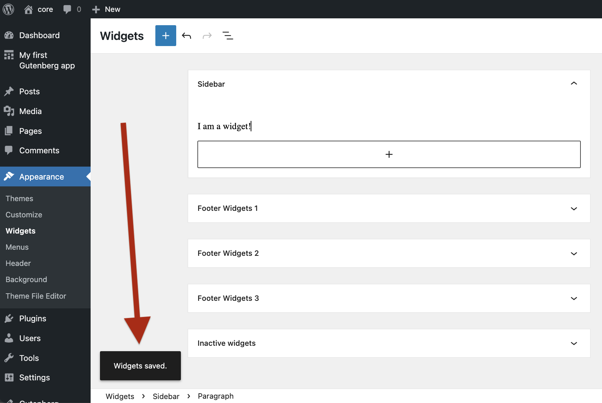
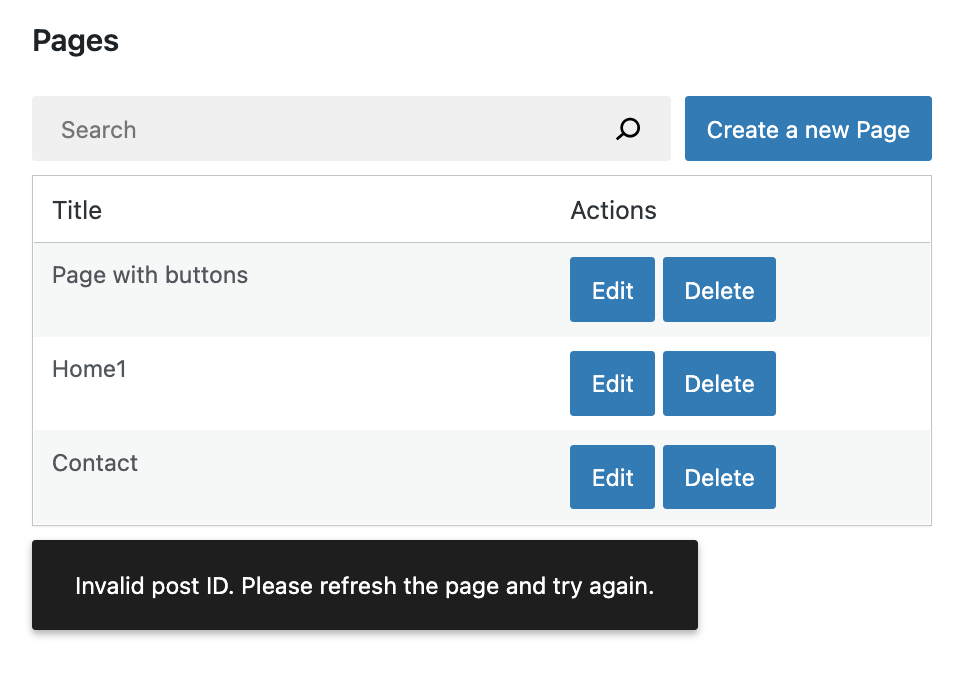
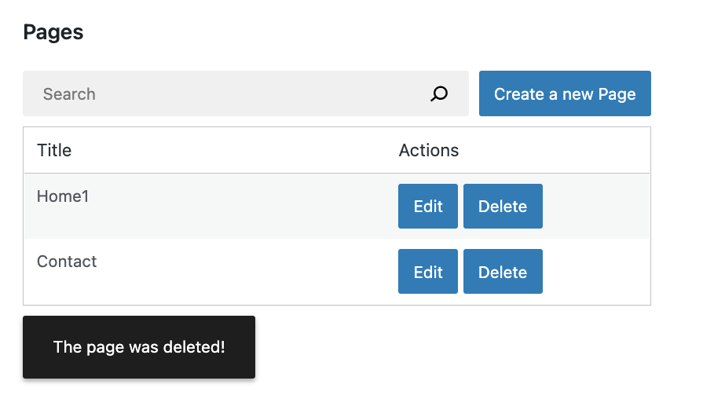

# Adding a delete button

In this section, we will add a *Delete* feature to our app. Here's a glimpse of what we're going to build:


### Step 1: Add a _Delete_ button

Let's start by creating the `DeletePageButton` component and updating the user interface of our `PagesList` component:

```js
import { Button } from '@wordpress/components';
import { decodeEntities } from '@wordpress/html-entities';

const DeletePageButton = () => (
	<Button variant="primary">
		Delete
	</Button>
)

function PagesList( { hasResolved, pages } ) {
	if ( ! hasResolved ) {
		return <Spinner />;
	}
	if ( ! pages?.length ) {
		return <div>No results</div>;
	}

	return (
		<table className="wp-list-table widefat fixed striped table-view-list">
			<thead>
				<tr>
					<td>Title</td>
					<td style={{width: 190}}>Actions</td>
				</tr>
			</thead>
			<tbody>
				{ pages?.map( ( page ) => (
					<tr key={page.id}>
						<td>{ decodeEntities( page.title.rendered ) }</td>
						<td>
							<div className="form-buttons">
								<EditPageButton pageId={ page.id } />
								<DeletePageButton pageId={ page.id } />
							</div>
						</td>
					</tr>
				) ) }
			</tbody>
		</table>
	);
}
```

This is what the PagesList should look like now:


### Step 2: Wire the button to a delete action

In Gutenberg data, we delete entity records from the WordPress REST API using the `deleteEntityRecord` action. It sends the request, processes the result, and updates the cached data in the Redux state.

Here's how you can try deleting entity records in your browser's dev tools:

```js
// We need a valid page ID to call deleteEntityRecord, so let's get the first available one using getEntityRecords.
const pageId = wp.data.select( 'core' ).getEntityRecords( 'postType', 'page' )[0].id;

// Now let's delete that page:
const promise = wp.data.dispatch( 'core' ).deleteEntityRecord( 'postType', 'page', pageId );

// promise gets resolved or rejected when the API request succeeds or fails.
```

Once the REST API request is finished, you will notice one of the pages has disappeared from the list. This is because that list is populated by the `useSelect()` hook and the `select( coreDataStore ).getEntityRecords( 'postType', 'page' )` selector. Anytime the underlying data changes, the list gets re-rendered with fresh data. That's pretty convenient!

Let's dispatch that action when `DeletePageButton` is clicked:

```js
const DeletePageButton = ({ pageId }) => {
	const { deleteEntityRecord } = useDispatch( coreDataStore );
	const handleDelete = () => deleteEntityRecord( 'postType', 'page', pageId );
	return (
		<Button variant="primary" onClick={ handleDelete }>
			Delete
		</Button>
	);
}
```

### Step 3: Add visual feedback

It may take a few moments for the REST API request to finish after clicking the _Delete_ button. Let's communicate that with a `<Spinner />` component similarly to what we did in the previous parts of this tutorial.

We'll need the `isDeletingEntityRecord` selector for that. It is similar to the `isSavingEntityRecord` selector we've already seen in [part 3](/docs/how-to-guides/data-basics/3-building-an-edit-form.md): it returns `true` or `false` and never issues any HTTP requests:

```js
const DeletePageButton = ({ pageId }) => {
	// ...
	const { isDeleting } = useSelect(
		select => ({
			isDeleting: select( coreDataStore ).isDeletingEntityRecord( 'postType', 'page', pageId ),
		}),
		[ pageId ]
	)
	return (
		<Button variant="primary" onClick={ handleDelete } disabled={ isDeleting }>
			{ isDeleting ? (
				<>
					<Spinner />
					Deleting...
				</>
			) : 'Delete' }
		</Button>
	);
}
```

Here's what it looks like in action:


### Step 4: Handle errors

We optimistically assumed that a *delete* operation would always succeed. Unfortunately, under the hood, it is a REST API request that can fail in many ways:

* The website can be down.
* The update may be invalid.
* The page could have been deleted by someone else in the meantime.

To tell the user when any of these errors happen, we need to extract the error information using the `getLastEntityDeleteError` selector:

```js
// Replace 9 with an actual page ID
wp.data.select( 'core' ).getLastEntityDeleteError( 'postType', 'page', 9 )
```

Here's how we can apply it in `DeletePageButton`:

```js
import { useEffect } from '@wordpress/element';
const DeletePageButton = ({ pageId }) => {
	// ...
	const { error, /* ... */ } = useSelect(
		select => ( {
			error: select( coreDataStore ).getLastEntityDeleteError( 'postType', 'page', pageId ),
			// ...
		} ),
		[pageId]
	);
	useEffect( () => {
		if ( error ) {
			// Display the error
		}
	}, [error] )

	// ...
}
```

The `error` object comes from the `@wordpress/api-fetch` and contains information about the error. It has the following properties:

* `message` – a human-readable error message such as `Invalid post ID`.
* `code` – a string-based error code such as `rest_post_invalid_id`. To learn about all possible error codes you'd need to refer to the [`/v2/pages` endpoint's source code](https://github.com/WordPress/wordpress-develop/blob/2648a5f984b8abf06872151898e3a61d3458a628/src/wp-includes/rest-api/endpoints/class-wp-rest-revisions-controller.php#L226-L230).
* `data` (optional) – error details, contains the `code` property containing the HTTP response code for the failed request.

There are many ways to turn that object into an error message, but in this tutorial, we will display the `error.message`.

WordPress has an established pattern of displaying status information using the `Snackbar` component. Here's what it looks like **in the Widgets editor**:




Let's use the same type of notifications in our plugin! There are two parts to this:

1. Displaying notifications
2. Dispatching notifications

#### Displaying notifications

Our application only knows how to display pages but does not know how to display notifications. Let's tell it!

The [`Snackbar` WordPress component](https://wordpress.github.io/gutenberg/?path=/story/components-snackbar--default) represents a single notification:


However, the user may delete a few pages one after another and expect to see a few notifications simultaneously. Then, it would be nice to have them automatically go away after a few seconds.

Luckily, the `SnackbarList` WordPress component can help us with all of that. It presents a list of notifications in an accessible, user-friendly manner. That's precisely the component used in the Widgets editor and in the rest of WordPress!

Here's how we can use it:

```js
import { SnackbarList } from '@wordpress/components';
import { store as noticesStore } from '@wordpress/notices';

function SnackbarNotices() {
	const notices = []; // We'll come back here in a second!

	return (
		<SnackbarList
			notices={ snackbarNotices }
			className="components-editor-notices__snackbar"
		/>
	);
}
```

That's all great, but the notices list is empty. How do we populate it? We'll lean on the same package as WordPress: [`@wordpress/notices`](https://github.com/WordPress/gutenberg/blob/895ca1f6a7d7e492974ea55f693aecbeb1d5bbe3/docs/reference-guides/data/data-core-notices.md).

Here's how:

```js
import { SnackbarList } from '@wordpress/components';
import { store as noticesStore } from '@wordpress/notices';

function SnackbarNotices() {
	const notices = useSelect(
		( select ) => select( noticesStore ).getNotices(),
		[]
	);
	const { removeNotice } = useDispatch( noticesStore );
	const snackbarNotices = notices.filter( ({ type }) => type === 'snackbar' );

	return (
		<SnackbarList
			notices={ snackbarNotices }
			className="components-editor-notices__snackbar"
			onRemove={ removeNotice }
		/>
	);
}

function MyFirstApp() {
	// ...
	return (
		<div>
			{/* ... */}
			<SnackbarNotices />
		</div>
	);
}
```

This tutorial is focused on managing the pages and won't discuss the above snippet in detail. If you're interested in the details of `@wordpress/notices`, the [handbook page](https://developer.wordpress.org/block-editor/reference-guides/data/data-core-notices/) is a good place to start.

Now we're ready to tell the user about any errors that may have occurred.

#### Dispatching notifications

With the SnackbarNotices component in place, we're ready to dispatch some notifications! Here's how:

```js
import { store as noticesStore } from '@wordpress/notices';
import { useEffect } from '@wordpress/element';
function DeletePageButton( { pageId } ) {
	const { createSuccessNotice, createErrorNotice } = useDispatch( noticesStore );
	// useSelect returns a list of selectors if you pass the store handle
	// instead of a callback:
	const { getLastEntityDeleteError } = useSelect( coreDataStore )
	const handleDelete = async () => {
		const success = await deleteEntityRecord( 'postType', 'page', pageId);
		if ( success ) {
			// Tell the user the operation succeeded:
			createSuccessNotice( "The page was deleted!", {
				type: 'snackbar',
			} );
		} else {
			// We use the selector directly to get the error at this point in time.
			// Imagine we fetched the error like this:
			//     const { lastError } = useSelect( function() { /* ... */ } );
			// Then, lastError would be null inside of handleDelete.
			// Why? Because we'd refer to the version of it that was computed
			// before the handleDelete was even called.
			const lastError = getLastEntityDeleteError( 'postType', 'page', pageId );
			const message = ( lastError?.message || 'There was an error.' ) + ' Please refresh the page and try again.'
			// Tell the user how exactly the operation has failed:
			createErrorNotice( message, {
				type: 'snackbar',
			} );
		}
	}
	// ...
}
```

Great! `DeletePageButton` is now fully aware of errors. Let's see that error message in action. We'll trigger an invalid delete and let it fail. One way to do this is to multiply the `pageId` by a large number:

```js
export function DeletePageButton( { pageId, onCancel, onSaveFinished } ) {
	pageId = pageId * 1000;
	// ...
}
```

Once you refresh the page and click any `Delete` button, you should see the following error message:




Fantastic! We can now **remove the `pageId = pageId * 1000;` line.**

Let's now try actually deleting a page. Here's what you should see after refreshing your browser and clicking the Delete button:




And that's it!

### Wiring it all together

All the pieces are in place, great! Here’s all the changes we've made in this chapter:

```js
import { useSelect, useDispatch } from '@wordpress/data';
import { useState, useEffect } from '@wordpress/element';
import { Button, Modal, TextControl } from '@wordpress/components';

function MyFirstApp() {
	const [searchTerm, setSearchTerm] = useState( '' );
	const { pages, hasResolved } = useSelect(
		( select ) => {
			const query = {};
			if ( searchTerm ) {
				query.search = searchTerm;
			}
			const selectorArgs = ['postType', 'page', query];
			const pages = select( coreDataStore ).getEntityRecords( ...selectorArgs );
			return {
				pages,
				hasResolved: select( coreDataStore ).hasFinishedResolution(
					'getEntityRecords',
					selectorArgs,
				),
			};
		},
		[searchTerm],
	);

	return (
		<div>
			<div className="list-controls">
				<SearchControl onChange={ setSearchTerm } value={ searchTerm }/>
				<PageCreateButton/>
			</div>
			<PagesList hasResolved={ hasResolved } pages={ pages }/>
			<SnackbarNotices />
		</div>
	);
}

function SnackbarNotices() {
	const notices = useSelect(
		( select ) => select( noticesStore ).getNotices(),
		[]
	);
	const { removeNotice } = useDispatch( noticesStore );
	const snackbarNotices = notices.filter( ( { type } ) => type === 'snackbar' );

	return (
		<SnackbarList
			notices={ snackbarNotices }
			className="components-editor-notices__snackbar"
			onRemove={ removeNotice }
		/>
	);
}

function PagesList( { hasResolved, pages } ) {
	if ( !hasResolved ) {
		return <Spinner/>;
	}
	if ( !pages?.length ) {
		return <div>No results</div>;
	}

	return (
		<table className="wp-list-table widefat fixed striped table-view-list">
			<thead>
				<tr>
					<td>Title</td>
					<td style={ { width: 190 } }>Actions</td>
				</tr>
			</thead>
			<tbody>
				{ pages?.map( ( page ) => (
					<tr key={ page.id }>
						<td>{ page.title.rendered }</td>
						<td>
							<div className="form-buttons">
								<PageEditButton pageId={ page.id }/>
								<DeletePageButton pageId={ page.id }/>
							</div>
						</td>
					</tr>
				) ) }
			</tbody>
		</table>
	);
}

function DeletePageButton( { pageId } ) {
	const { createSuccessNotice, createErrorNotice } = useDispatch( noticesStore );
	// useSelect returns a list of selectors if you pass the store handle
	// instead of a callback:
	const { getLastEntityDeleteError } = useSelect( coreDataStore )
	const handleDelete = async () => {
		const success = await deleteEntityRecord( 'postType', 'page', pageId);
		if ( success ) {
			// Tell the user the operation succeeded:
			createSuccessNotice( "The page was deleted!", {
				type: 'snackbar',
			} );
		} else {
			// We use the selector directly to get the error at this point in time.
			// Imagine we fetched the error like this:
			//     const { lastError } = useSelect( function() { /* ... */ } );
			// Then, lastError would be null inside of handleDelete.
			// Why? Because we'd refer to the version of it that was computed
			// before the handleDelete was even called.
			const lastError = getLastEntityDeleteError( 'postType', 'page', pageId );
			const message = ( lastError?.message || 'There was an error.' ) + ' Please refresh the page and try again.'
			// Tell the user how exactly the operation have failed:
			createErrorNotice( message, {
				type: 'snackbar',
			} );
		}
	}

	const { deleteEntityRecord } = useDispatch( coreDataStore );
	const { isDeleting } = useSelect(
		select => ( {
			isDeleting: select( coreDataStore ).isDeletingEntityRecord( 'postType', 'page', pageId ),
		} ),
		[ pageId ]
	);

	return (
		<Button variant="primary" onClick={ handleDelete } disabled={ isDeleting }>
			{ isDeleting ? (
				<>
					<Spinner />
					Deleting...
				</>
			) : 'Delete' }
		</Button>
	);
}
```

## What's next?

* **Previous part:** [Building a *Create page form*](/docs/how-to-guides/data-basics/4-building-a-create-page-form.md)
* (optional) Review the [finished app](https://github.com/WordPress/gutenberg-examples/tree/trunk/09-code-data-basics-esnext) in the gutenberg-examples repository
